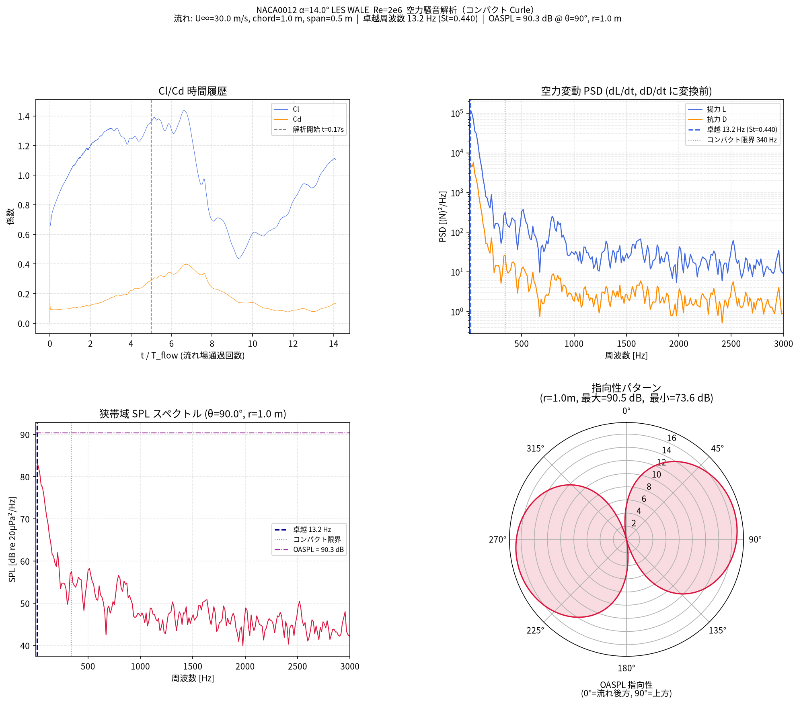

For the past two years, major CAE vendors have been telling me about CAE agents. I also built AI agents myself using LangChain and surveyed the literature.

After falling ill and losing my job, I recently got back on my feet. On a whim last night, I decided to try running a low-Reynolds-number airfoil flow simulation with Claude Code — something I had been curious about for a long time. Six months ago, the conventional approach would have been to build a dedicated AI agent trained on OpenFOAM's library. Instead, I simply told vanilla Claude Code what I wanted to do.

The results were astonishing.

Claude Code set up an OpenFOAM environment on my Mac mini and ran the simulation. OpenFOAM's library structure and usage differ drastically between versions and forks, which should make it difficult to script programmatically. Claude got it right.

What I wanted to see was airfoil flow hysteresis and aeroacoustic noise, but Claude's knowledge of fluid dynamics turned out to be deeper than mine. With just a brief description, it built simulation cases that captured stall phenomena and visualized wake vortices using Q-criterion. The video and plots in this article were created by Claude on its own initiative.
Claude even looked at the images it had generated and expressed excitement at seeing the vortex structures. I wonder if it understood how difficult the simulation it had been asked to run really was.

<video controls width="100%">
  <source src="naca0012_les_Q2000.mp4" type="video/mp4">
</video>

What surprised me most was that when the numerical computation diverged, Claude inspected the mesh, identified the problem, and regenerated it. A human would typically suffer enough psychological damage from a CFD divergence to give up entirely. It was also impressive that Claude decided on its own to switch the mesher from non-orthogonal to orthogonal grids.

I had only intended to play around with fluid simulations, but now I need to think seriously. Even on an unemployed person's Mac mini with nothing but open-source tools, advanced LES computations were possible. With a full-scale agent from Ansys or Rescale backed by expensive commercial software, the capabilities must already be at an extraordinary level.

When CAE becomes work for LLMs, commercial CAE development strategies will change dramatically.
Claude Code operates via CLI, so it excels with command-line meshers. The GUI-based automatic meshing in expensive commercial software — convenient for humans — is awkward for it. The mesher most convenient for Claude is probably Gridgen.

There is a lot of momentum around AI for manufacturing as part of the Physical AI movement, but AI for development and design may have reached a tipping point before manufacturing did. 

A future where factories are emptied of people is still too distant a goal, but a future where people disappear from the development process now seems visible.

In manufacturing, the upstream processes of development and design have the greatest impact on product cost. The more advanced a company is, the stronger its simulation capabilities and the more it centers development in the virtual domain. (I have heard that Toyota validated the superiority of the Toyota Hybrid System through simulation during the original Prius development. Coming from a consumer electronics background, that level of capability is almost unbelievable.)

At forward-thinking companies, organizational restructuring around LLMs is probably already underway. Meanwhile, manufacturers that lack modeling capabilities and rely on physical prototyping will lose price competitiveness due to high labor costs and long development cycles. In each industry, it may come down to just one or two advanced companies surviving — though rather than worrying about other companies, I should be worrying about my next appointment at the employment office.

Three months from now, things will surely be even more extraordinary.
