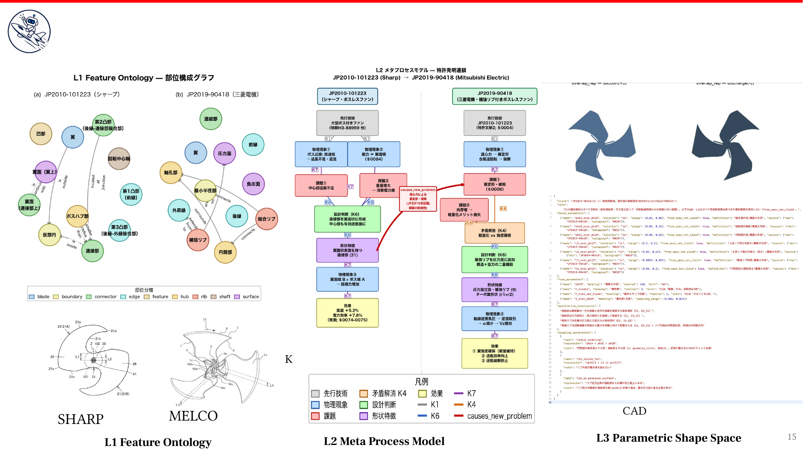
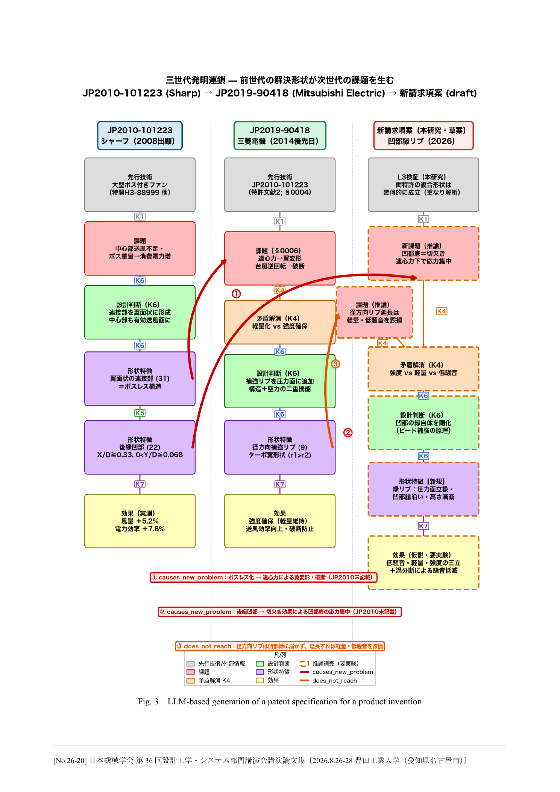

「LLMにCADを渡せば、ハードウェア設計もかなり自動化できる」。そう考える人は多いと思う。私も、LLMがCAEを操作し、解析結果を読み、改善案を出すところまで来たことには率直に驚いている。

今回は、日本機械学会（設計工学システム部門講演会）の発表をもとに、LLMのハードウェア設計への応用について記事を書きます。

私は、空調分野の研究開発に長く取り組んでいました。
自分の経験をもととにルームエアコンの室外機用プロペラファン設計についてLLMを使ってみました。

一概にハードウェア設計といっても、実際にプロペラファンを一枚設計してみると、非常に多くの複雑なノウハウを知っていることが必要です。

プロペラファンの翼の反りやねじれ、前縁・後縁の形、翼根の肉厚、補強リブ、ボス周りの形状。少し手を入れるだけで、風量、静圧、効率、騒音、強度、振動、成形性、コストが連鎖して変わる。風量を上げるつもりの変更が騒音を増やすこともある。軽量化が遠心力に対する強度や疲労寿命を苦しくすることもある。

Computational Fluid Dynamics (CFD)のコンターを見て「この渦が悪そうだ」と判断し、翼のどこをどの方向に変えるかを決める。さらに、強度解析や実験で確かめながら量産できる形に着地させる。これは、空気力学、構造、材料、金型、製品の使われ方を行き来する仕事だ。現場でこの判断を一貫してできる人は、ごく少数のエキスパートに限られる。

だから私は、ハードウェアにLLMを使う鍵は「もっと賢いモデル」だけではなく、**設計意図をLLMが読める構造にすること**だと考えている。そして、そのために少し昔の設計工学がとても役に立つ。

## 結論を先に

- LLMは、設計文書を読み、用語の違いを吸収し、アイデアを文章や図に展開する仕事で強い。
- 一方、形状が生む流れ・応力・騒音を正しく評価するには、CAE、実験、そして設計者の判断が要る。
- この二つをつなぐ共通言語が「何があるか」「なぜそうしたか」「どんな形として成立するか」を残す設計工学の表現である。

## 製造AIで問われているのは、実はデータモデルである

いま製造AIは大きなテーマになっている。経済産業省とNEDOも、2026年度から製造業データをAIが利用できる状態にする「AI-Ready化」の研究開発を支援している。[GENIACの取り組み](https://www.meti.go.jp/press/2026/05/20260514001/20260514001.html)は、その流れを象徴している。

また、Palantirが提唱するOntologyも、組織にある対象、属性、関係、アクションをつなぎ、業務のデジタルツインとして扱う考え方だ。[公式ドキュメント](https://www.palantir.com/docs/foundry/ontology/overview/)を読むと、単にデータを集めるのではなく、現場の意味を機械が扱える形にすることが本質だと分かる。

ハードウェア設計にも、同じ問題がある。ただし、部品表やCADファイルだけをつないでも十分ではない。設計では、必ず「なぜこの形なのか」が問われるからだ。

例えば、あるリブは「補強のため」に見える。しかし本当に知りたいのは、その言葉の先にある設計判断である。どの荷重や振動モードを抑えたいのか。なぜその位置なのか。肉厚を増やすと空力や成形に何が起きるのか。どのCAE結果や実験が、その判断を支えているのか。

この因果が抜け落ちたままでは、LLMは形をもっともらしく並べられても、設計の中身に踏み込めない。

## プロペラファンは「形を出す」だけでは設計にならない

空調室外機に使うプロペラファンは、身近な部品に見える。その一方で、回転翼の空力設計としては非常に難しい対象だ。

設計者は、翼の半径方向ごとの流入角や荷重分布を考え、必要な風量と静圧を得ながら、損失と騒音を抑える。翼の後流や翼端付近の流れ、モータやベルマウスとの干渉も無視できない。そこへ遠心力、繰返し応力、共振、樹脂の成形性、金型の抜き勾配、コストが重なる。

つまり、専門知識だけでも足りない。解析結果と実機の振る舞いを何度も見てきた設計センスが必要になる。LLMがこの設計者を置き換えると考えるより、エキスパートの判断を再利用できる知識に変えるほうが、いまの技術でははるかに現実的だ。

## 「What / Why / Where」で設計意図を残す

ここで設計意図の構造化に使えるのが設計工学だ。
今回は、プロペラファンの設計の知見を構造化するために、野間口先生の研究を使ってメタプロセスモデルという手法を使った。

メタプロセスモデルは、設計意図を分類したコードで構成した設計者の認知モデルだ。
詳しくは、本記事の巻末にある野間口先生の博士論文を読んで欲しい。

実際に使った例を見た方が理解が早い。
空調用プロペラファンに関する二つの特許文書を題材に、LLMで設計知識を三層に分けて抽出した。

| 層 | LLMに渡す問い | 設計情報の例 |
| --- | --- | --- |
| L1: Feature Ontology | 何が存在するか | 翼、ハブ、リブ、内周部などの部位と接続・包含関係 |
| L2: Meta Process Model | なぜその設計にしたか | 要求、従来技術の問題、設計判断、物理現象、効果、検証根拠 |
| L3: Parametric Shape Space | どんな幾何として成立するか | 寸法・拘束条件、設計変数、パラメトリックCADスクリプト |

*図1. プロペラファンの二つの特許を、部位構成、設計意図、パラメトリック形状の三層で表した。発表資料をもとに筆者作成。*

ここでいうL2がメタプロセスモデルだ。
野間口先生が2000年代に取り組んだ設計知識管理に由来する。成果物としてのCADや図面だけではなく、「どの情報から、どんな判断を経て、その形へ至ったか」をメタプロセスモデルとして残す考え方だ。当時は設計文書の自動生成・管理が主な用途だった。いま見ると、これはLLMが設計を読むための入力形式として驚くほど相性がよい。

L1だけなら、部品の関係を表すオントロジーに近い。重要なのはL2である。L2には、要求・目的、従来技術の問題、構造、設計根拠、物理現象、効果、外部知識を残す。私はこれをK1からK7のコードとして整理した。

この層があると、「翼にリブがある」という事実と、「このリブをこの方向に置くことで、空力的な制約を壊さずに強度を確保したい」という設計意図を分けて扱える。LLMは両者を混同せず、前後の特許で同じ役割を持つ別の用語も対応付けられるようになる。

L3には、設計者が本当に触れる形状空間を置く。ここまで来て初めて、LLMが提案したアイデアをCADで成立させ、CFDや有限要素解析で検証するループに入れられる。

## 特許明細書は、権利書類であると同時に設計意図の記録でもある

特許明細書には、「従来技術の何が問題か」「どんな構造で解くか」「どんな効果を狙うか」が書かれている。構想設計の記録として読むと、意外なほど情報量が多い。

今回の事例では、シャープのプロペラファン特許と、これを先行技術として引用する三菱電機の軸流ファン特許を比較した。LLMは、部位の名称が異なっていても、位置や機能、接続関係を手掛かりに対応付ける。さらに、解決策が次の世代でどんな新しい課題を生んだかを、設計判断と物理現象の連鎖として可視化した。

*図2. 課題、設計判断、形状特徴、効果の連鎖を追うことで、特許間の発明の発展を可視化した。右端の案はLLMが生成した仮説であり、性能や特許性を保証するものではない。発表資料をもとに筆者作成。*

この図の右端にある新規請求項案は、LLMが出した「仮説」にすぎない。凹部のリブや翼形状を提案できても、低騒音、軽量、強度を本当に両立できるかは、形状を作ってCFD、強度解析、試験で確かめなければ分からない。特許性の判断も、先行技術調査と専門家の評価が必要だ。

それでも価値は大きい。過去のエキスパートが何を問題と見なし、どんな矛盾をどう解いたかを、人とLLMが一緒にたどれるようになるからだ。

## LLM、CAE、エキスパートの役割を分ける

私は、ここで人とAIの勝敗を論じたいわけではない。むしろ、役割をきれいに分けたほうがハードウェア設計は強くなる。

| 担当 | 強み | 設計プロセスでの役割 |
| --- | --- | --- |
| LLM | 文書読解、比較、記録、案の展開 | 特許・報告書・設計レビューから意図を抽出し、論点や候補案を整理する |
| CAE・実験 | 物理現象の検証 | 形状が性能、強度、騒音、信頼性に与える影響を評価する |
| エキスパート | 問いの設定と統合判断 | 何を最適化するか、どの制約を優先するか、結果をどう設計へ戻すかを決める |

LLMには、設計者が持つ暗黙知を「いきなり正解に変換する」ことを期待しない。まず、文書と会話の中に散らばった判断を、検証可能な設計知識として残してもらう。その上で、人が形を作り、CAEと実験が物理を確かめる。この順番なら、LLMはエキスパートの能力を薄めず、むしろ組織に広げられる。

## AI-Readyな製造業は、設計意図までAI-Readyにする

製造業でAIを使うとき、CAD、PLM、BOM、CAE結果、試験レポートを集めることは出発点になる。次に必要なのは、それらを次のような因果でつなぐことだ。

> 要求 → 問題 → 設計判断 → 形状特徴 → 物理現象 → 効果 → CAE・実験による根拠

この鎖を持てば、LLMは「どの形があったか」だけでなく、「何のためにその形を選んだのか」を質問できる。似た設計を検索するときも、寸法や部品名だけではなく、解きたい矛盾や狙う効果で探せる。

設計工学は、AI以前の知識管理の話に見えるかもしれない。しかしLLM時代には、設計者、CAE、CAD、特許、試験データをつなぐインターフェースになる。古い方法論をそのまま保存するのではない。LLMが扱えるデータモデルとして、現場に再実装する価値がある。

最初の一歩は大きなデータ基盤ではなくてよい。過去の一件の設計レビュー、CFD報告書、あるいは特許を選び、「目的」「問題」「設計判断」「物理現象」「効果」「検証根拠」を書き出してみる。そこから、ハードウェアのためのOntologyが始まる。

設計意図をどう残し、どう継承するかに悩んでいる方がいれば、ぜひスキやコメントで教えてほしい。次はこの三層モデルを、実際のCAD・CAEワークフローにどう接続するかを書いてみたい。

---

### 参考

- 池田孟「大規模言語モデルを用いた特許明細書生成による構想設計支援」日本機械学会 第36回設計工学・システム部門講演会講演論文集, 2026.
- 野間口大「CADのための設計知識管理の研究」東京大学博士論文, 2002.
- [経済産業省・NEDO: 製造業データ等のAI-Ready化に関する研究開発](https://www.meti.go.jp/press/2026/05/20260514001/20260514001.html)
- [Palantir: Ontology overview](https://www.palantir.com/docs/foundry/ontology/overview/)
